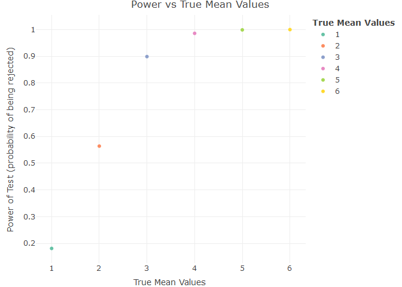
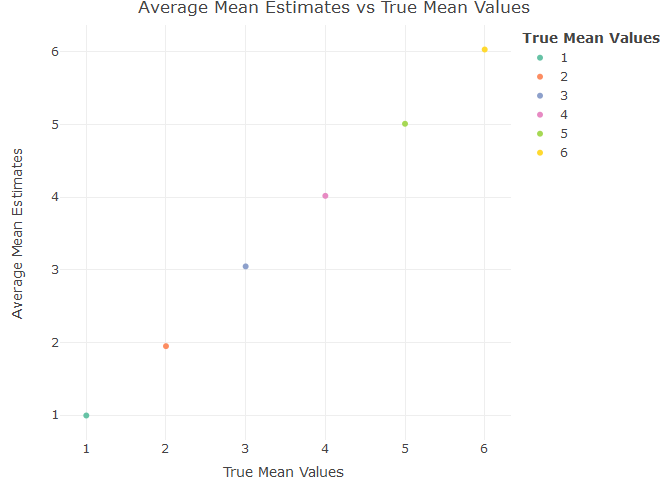
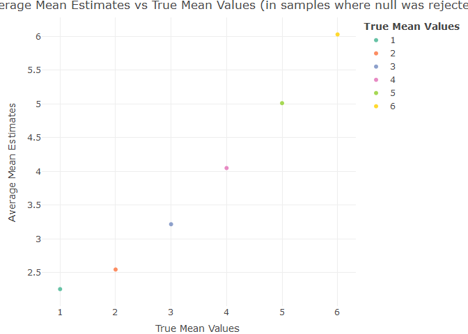

hw5_hg2596
================
2022-11-10

``` r
library(tidyverse)
```

    ## ── Attaching packages ─────────────────────────────────────── tidyverse 1.3.2 ──
    ## ✔ ggplot2 3.3.6      ✔ purrr   0.3.4 
    ## ✔ tibble  3.1.8      ✔ dplyr   1.0.10
    ## ✔ tidyr   1.2.0      ✔ stringr 1.4.1 
    ## ✔ readr   2.1.2      ✔ forcats 0.5.2 
    ## ── Conflicts ────────────────────────────────────────── tidyverse_conflicts() ──
    ## ✖ dplyr::filter() masks stats::filter()
    ## ✖ dplyr::lag()    masks stats::lag()

``` r
library(readxl)
library(lubridate)
```

    ## 
    ## Attaching package: 'lubridate'
    ## 
    ## The following objects are masked from 'package:base':
    ## 
    ##     date, intersect, setdiff, union

``` r
library(tidyr)
library(dplyr)
library(plotly)
```

    ## 
    ## Attaching package: 'plotly'
    ## 
    ## The following object is masked from 'package:ggplot2':
    ## 
    ##     last_plot
    ## 
    ## The following object is masked from 'package:stats':
    ## 
    ##     filter
    ## 
    ## The following object is masked from 'package:graphics':
    ## 
    ##     layout

# Problem 2

``` r
homicide_1= read_csv("./data/homicide_data.csv", show_col_types = FALSE)
```

# Create a city_state variable

``` r
homicide_1 = homicide_1 %>%
  unite('city_state', city:state, remove = FALSE) %>% 
  apply(., 2, function(city_state) as.character(gsub("_", ",", city_state))) 
```

The homicide raw data has 52179observations and 13 variables. Key
variables

``` r
homicide_2 = as.tibble(homicide_1) %>%
  janitor::clean_names() %>%
  mutate(victim_age = as.numeric(victim_age)) %>%
  mutate(lat = as.numeric(lat)) %>%
  mutate(lon = as.numeric(lon)) %>%
  mutate(status = ifelse(disposition%in%c("Closed without arrest","Open/No arrest"), 1, 0))
```

    ## Warning: `as.tibble()` was deprecated in tibble 2.0.0.
    ## Please use `as_tibble()` instead.
    ## The signature and semantics have changed, see `?as_tibble`.
    ## This warning is displayed once every 8 hours.
    ## Call `lifecycle::last_lifecycle_warnings()` to see where this warning was generated.

    ## Warning in mask$eval_all_mutate(quo): NAs introduced by coercion

``` r
sum_hc = homicide_2 %>%
  group_by(city) %>%
  summarize(n_obs = n(), 
            n_unsolved = sum(status)) 
```

``` r
baltimore_hc = sum_hc %>% 
  filter(city == "Baltimore") 
```

# Prop test Baltimore

``` r
first_prop = prop.test(x = pull(baltimore_hc,n_unsolved), n = pull(baltimore_hc,n_obs)) %>%
  broom::tidy()
```

For Baltimore, the probability of having an unsolved case is .

# Prop test all citities

# Make a dataset to hold “x” and “y”

``` r
 hold_xy = 
  tibble(homicide_2 %>%
    group_by(city) %>%
    summarize(n_obs = n(), 
            n_unsolved = sum(status)))
```

# Make a function with prop.test

``` r
function_xy = function(x, y) {

 prop.test(x,y) %>%
    broom::tidy()
}
```

# Map over function and clean

``` r
map2_holdxy = 
 hold_xy %>%
  mutate(
    estimate_df = 
      map2(.x = n_unsolved,.y = n_obs, ~function_xy(x = .x, y = .y))
  ) %>% 
  unnest(estimate_df) %>%
  select( - parameter, -method, -alternative, -statistic)
```

# Graph estimates and Cl’s

``` r
graph_p_1 = 
  ggplot(map2_holdxy, aes(x = city, y = estimate)) + 
  geom_point() +
  geom_errorbar(aes(x = , y = ))
```

p\<- ggplot(df2, aes(x=dose, y=len, fill=supp)) +
geom_bar(stat=“identity”, color=“black”, position=position_dodge()) +
geom_errorbar(aes(ymin=len-sd, ymax=len+sd), width=.2,
position=position_dodge(.9))

# Problem 3

# Create a function

``` r
function_a = function(true_mean) 
{
  x = tibble(rnorm(30,true_mean,5))
  
  t.test(x, mu = 0) %>%
    broom::tidy()

}
```

# Map over function for Mu = 0

``` r
map_df = 
  expand_grid(
    true_mean = 0, 
    iter = 1:100) %>% 
  mutate(
    estimate_df = map(.x = true_mean,~function_a(true_mean = .x))) %>%
  unnest(estimate_df)
```

# Map over function for Mu = 1:6

``` r
map_df = 
  expand_grid(
    true_mean = 1:6, 
    iter = 1:1000) %>% 
  mutate(
    estimate_df = map(.x = true_mean,~function_a(true_mean = .x))) %>%
  unnest(estimate_df)
```

# Clean data and create variable

``` r
final_map = 
  map_df %>%
  janitor::clean_names()%>%
  mutate(estimate = as.numeric(estimate)) %>%
  mutate(p_value = as.numeric(p_value)) %>%
  mutate(true_mean = as.character(true_mean)) %>%
  mutate(reject_null = ifelse(p_value < 0.05, 1, 0)) %>%
  mutate(reject_null = as.numeric(reject_null)) %>%
  mutate(mu_hat = estimate) %>%
  select(true_mean, iter, mu_hat, p_value,reject_null) 
```

# Summarize 1

``` r
final_map_2 = final_map %>%
  group_by(true_mean) %>%
  summarize(n_obs = n(), 
            probability_reject = (sum(reject_null))/n_obs,
            new_mu = mean(mu_hat)) 
```

# Summarize 2

``` r
final_map_3 = 
  final_map %>%
  filter(reject_null == 1) %>%
  group_by(true_mean) %>%
  summarize(n_obs = n(), 
            probability_reject = (sum(reject_null))/n_obs,
            new_mu = mean(mu_hat)) 
```

# Graph 1

``` r
graph_1 = 
  final_map_2 %>%
  plot_ly(x = ~true_mean, y = ~probability_reject, type = "scatter", mode = "markers",color = ~ true_mean, alpha = 1.2)%>% 
  layout(title = 'Power vs True Mean Values',
         xaxis = list(title = 'True Mean Values'),
         yaxis = list(title = 'Power of Test (probability of being rejected)'), 
         legend = list(title=list(text='<b> True Mean Values </b>'))) 

graph_1
```

<!-- -->

# Graph 2

``` r
graph_2 = 
  final_map_2 %>%
  plot_ly(x = ~true_mean, y = ~new_mu, type = "scatter", mode = "markers",color = ~ true_mean, alpha = 1.2) %>% 
  layout(title = 'Average Mean Estimates vs True Mean Values',
         xaxis = list(title = 'True Mean Values'),
         yaxis = list(title = 'Average Mean Estimates'), 
         legend = list(title=list(text='<b> True Mean Values </b>')))

graph_2
```

<!-- -->

# NONE

``` r
graph_3 = 
  final_map_3 %>%
  plot_ly(x = ~true_mean, y = ~new_mu, type = "scatter", mode = "markers",color = ~ true_mean, alpha = 1.2) %>%
  layout(title = 'Average Mean Estimates vs True Mean Values (in samples where null was rejected)',
         xaxis = list(title = 'True Mean Values'),
         yaxis = list(title = 'Average Mean Estimates'), 
         legend = list(title=list(text='<b> True Mean Values </b>')))

graph_3 
```

<!-- -->

\#lay it on top of eachother??
